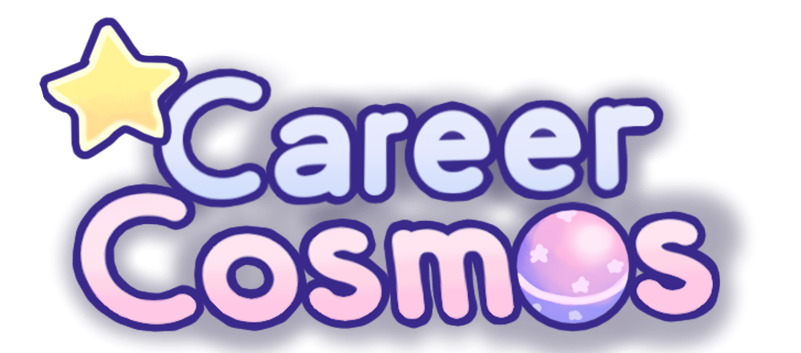

# ☄️Career Cosmos 

A video game made for FBLA's Computer Game and Simulation Programming 2025-2026 Event!

## ⭐ About Career Cosmos

**Career Cosmos** is an educational exploration game created in **Godot Game Engine.** You travel to different mini-worlds or planets each themed after a different career. I created this game to be both fun and educational, with a target audience of children learning about careers.

## 🚀 Gameplay Preview

  
  
 

## 💫 Other Info
**Engine:** Godot 4

**Language:** GDScript

**Artwork:** Krita

###### Made with ❤️ by Ang 
